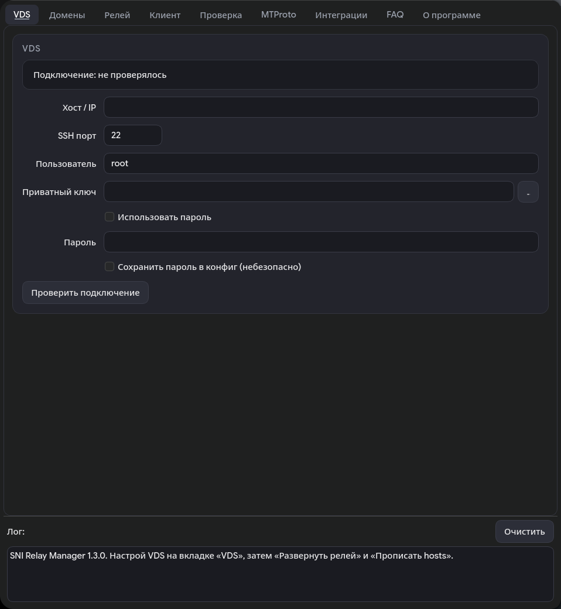
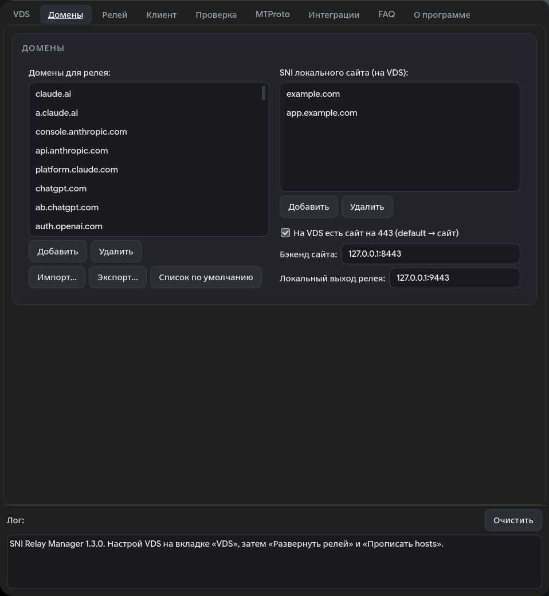
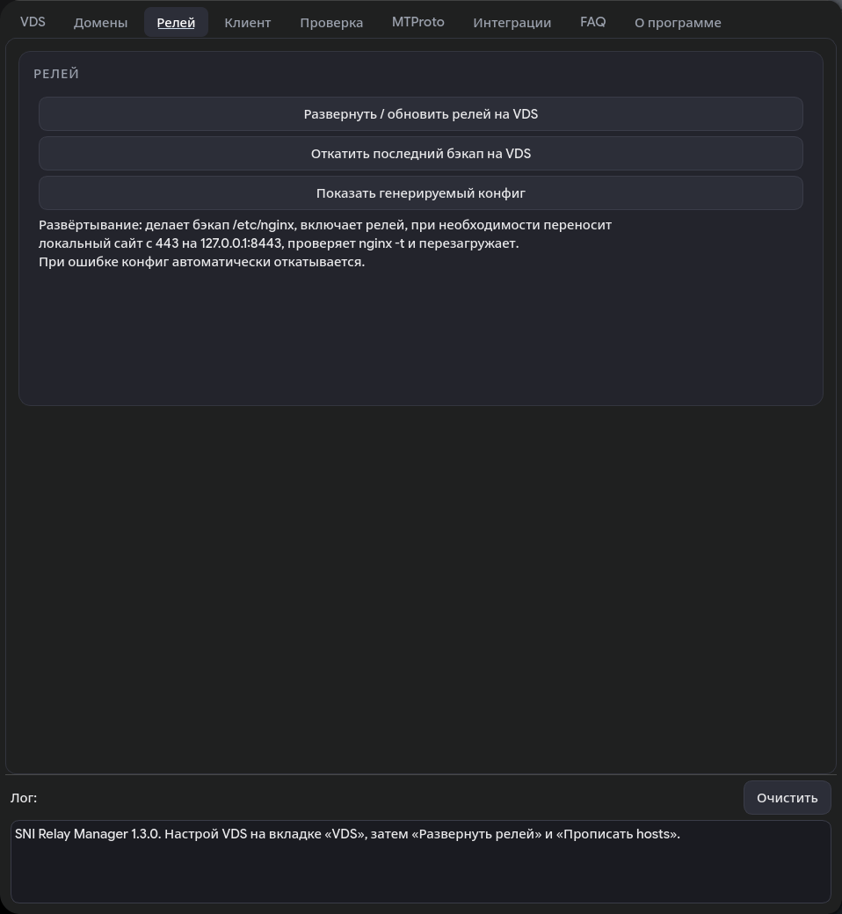
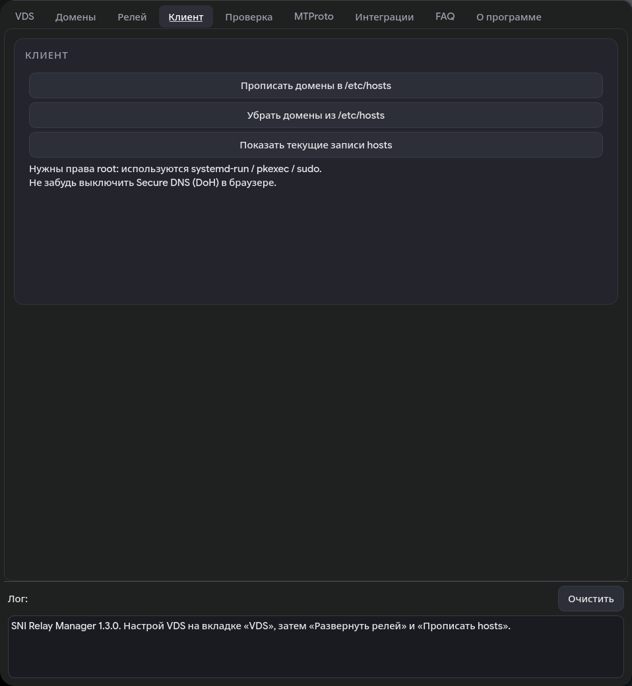
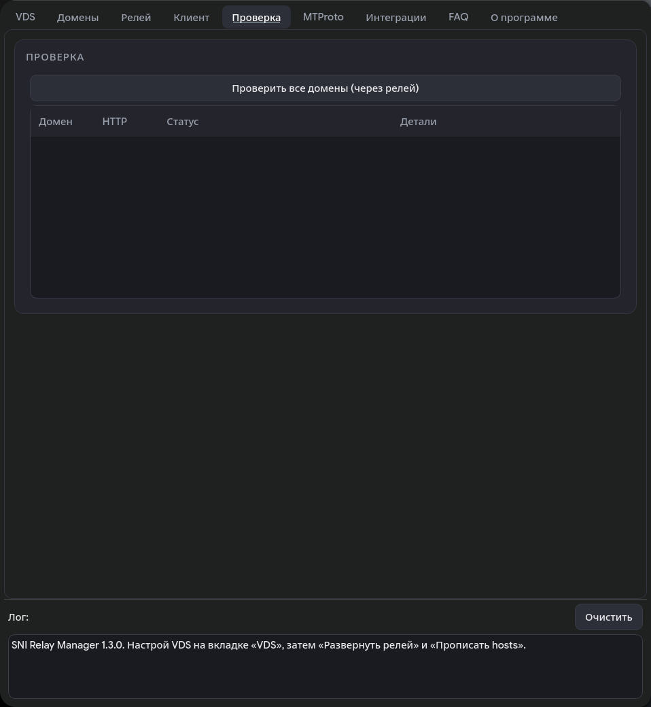
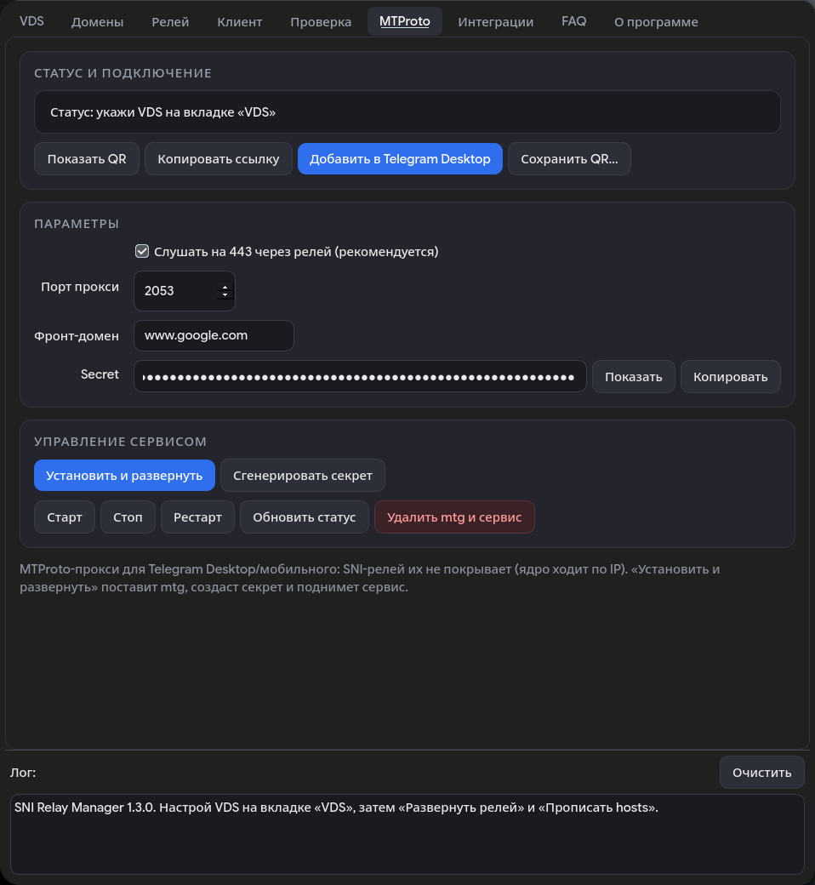
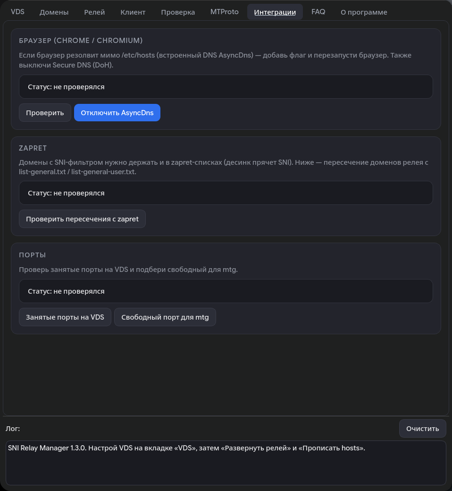
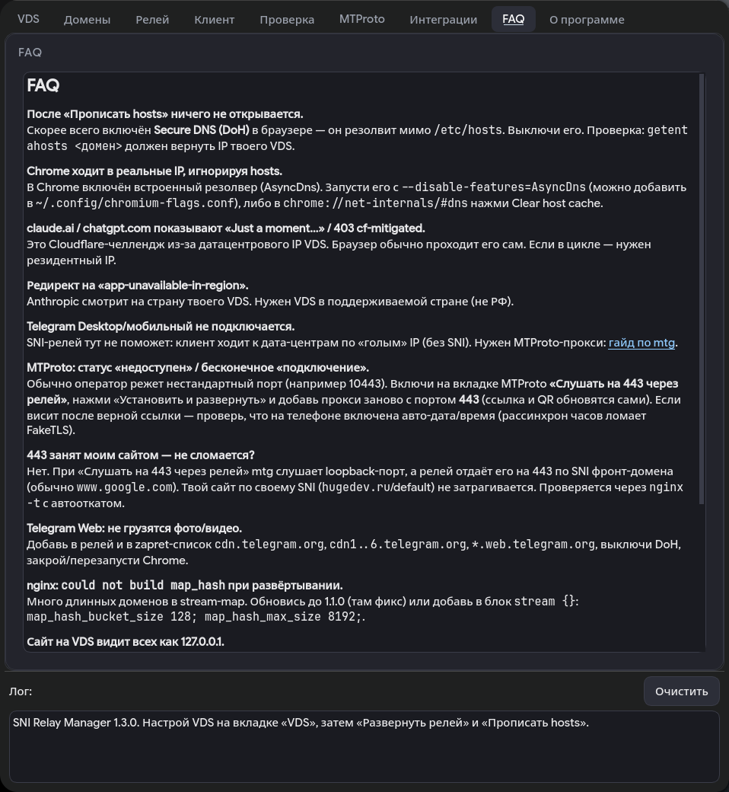
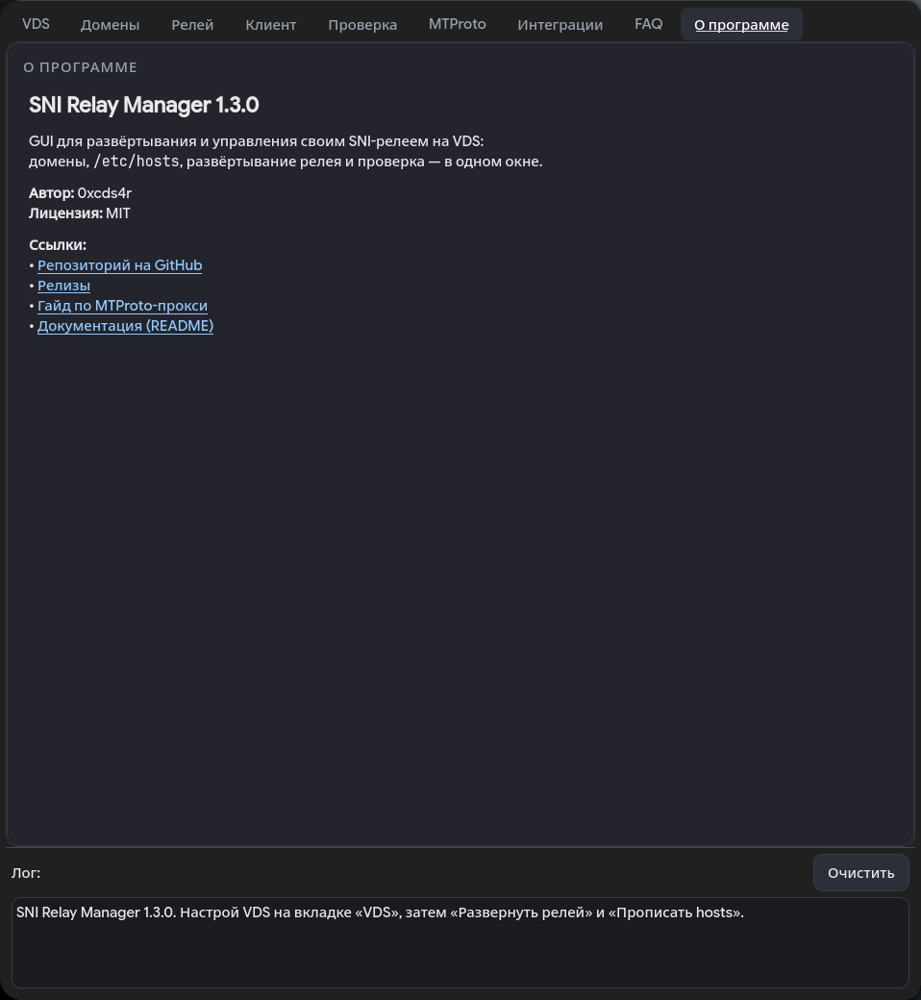

# SNI Relay

GUI-приложение на C++/Qt6 для управления своим SNI-релеем на VDS:
развёртывание, домены, `/etc/hosts` на клиенте и проверка — в одном окне.

Обёртка над гайдом из родительского каталога: те же действия, без ручного
редактирования конфигов.

## Возможности

- **VDS** — хост, порт, пользователь, ключ или пароль (SSH), кнопка
  «Проверить подключение» (geo, nginx, stream-модуль, доступность `claude.ai`).
- **Домены** — редактируемый список доменов для релея + SNI локального сайта;
  импорт/экспорт `.txt`, сброс к списку по умолчанию.
- **Релей** — «Развернуть/обновить» (бэкап `/etc/nginx`, конфиг, перенос сайта
  на 8443, `nginx -t`, reload, автооткат при ошибке) и «Откатить».
- **Клиент** — прописать/убрать домены в `/etc/hosts` (через
  systemd-run/pkexec/sudo), показать текущие записи.
- **Проверка** — параллельный (пул) прогон всех доменов через релей с цветной
  таблицей: `OK` / `challenge` / `REGION BLOCK` / `нет ответа`.
- **MTProto** — установка `mtg` на VDS, генерация секрета, systemd-сервис,
  старт/стоп/рестарт/статус/удаление, вывод прокси на **443 через релей**
  (SNI фронт-домена), ссылка `t.me/proxy`, **QR с логотипом** и
  «Добавить в Telegram Desktop».
- **Интеграции** — проверка/включение `--disable-features=AsyncDns` для
  Chrome/Chromium, пересечение доменов с zapret-списками, занятые/свободные
  порты на VDS.
- **Linux и Windows** — одна кодовая база. На Windows `ssh.exe`/`curl.exe` лежат
  рядом с `.exe`, `hosts` правится напрямую (или через PowerShell с правами
  администратора), QR рисуется встроенным `qrcodegen`.
- **FAQ / О программе** — разбор частых проблем, версия, автор, ссылки.
- **Загрузочный экран** — оверлей на время длительных операций.
- **Лог** — весь вывод выполняемых команд.

Пароли и настройки хранятся в `~/.config/sni-relay-manager/config.json`;
пароль — только если включена галка «Сохранить».

## Скриншоты

| VDS | Домены | Релей |
|---|---|---|
|  |  |  |
| **Клиент** | **Проверка** | **MTProto** |
|  |  |  |
| **Интеграции** | **FAQ** | **О программе** |
|  |  |  |

## Установка из релизов

Скачай из [Releases](https://github.com/0xcds4r/sni-relay/releases/tag/sni-relay-manager):

- **AppImage**: `chmod +x sni-relay-manager-*.AppImage && ./sni-relay-manager-*.AppImage`
- **deb**: `sudo apt install ./sni-relay-manager_*_amd64.deb`

## Зависимости (для сборки из исходников)

- Qt6 (Widgets), CMake ≥ 3.16, компилятор C++17, Ninja/Make
- `libqrencode` (для QR во вкладке MTProto) + `pkg-config`
- Системные утилиты: `ssh`, `curl`, `setsid`; для прав root —
  `systemd-run` / `pkexec` / `sudo`

Arch/CachyOS: `sudo pacman -S qt6-base qt6-svg libqrencode cmake ninja gcc pkgconf`
Ubuntu/Debian: `sudo apt install qt6-base-dev qt6-svg-dev libqrencode-dev cmake ninja-build g++ pkg-config`

Для Windows-сборки (кросс из Linux): `mingw-w64-gcc`, `cmake`, `ninja` и Qt6
для MinGW (`win64_mingw`), внешний `libqrencode` не нужен.

## Сборка и запуск

Linux:

```bash
cmake -S . -B build -G Ninja -DCMAKE_BUILD_TYPE=Release
cmake --build build
./build/sni-relay-manager
```

Установка в систему (опционально):

```bash
sudo cmake --install build          # /usr/local/bin/sni-relay-manager
```

### Windows (кросс-сборка из Linux)

```bash
cmake -S . -B build-win -G Ninja \
  -DCMAKE_TOOLCHAIN_FILE=toolchain-mingw.cmake \
  -DCMAKE_PREFIX_PATH=/path/to/Qt/6.x.x/mingw_64 \
  -DQT_HOST_PATH=/path/to/Qt/6.x.x/gcc_64 \
  -DCMAKE_BUILD_TYPE=Release
cmake --build build-win
```

Готовый `sni-relay-manager.exe` кладётся рядом с Qt-DLL (`Qt6Core/Gui/Widgets/Svg`),
`platforms/qwindows.dll`, `styles/`, `imageformats/` и `qt.conf`, а также с
`ssh.exe` и `curl.exe` — приложение ищет их рядом с собой. QR рисуется встроенным
`qrcodegen`. Права администратора для правки `hosts` запрашиваются через
PowerShell; можно запускать приложение от имени администратора.

## CLI (без GUI)

Удобно для скриптов и проверки:

```bash
sni-relay-manager --print-config        # показать сгенерированный relay.conf
sni-relay-manager --print-deploy        # показать скрипт развёртывания
sni-relay-manager --print-rollback      # показать скрипт отката
sni-relay-manager --print-hosts         # показать новый /etc/hosts
sni-relay-manager --print-config-path   # путь к config.json
sni-relay-manager --ssh-test            # проверить SSH-подключение к VDS
sni-relay-manager --mtg-link            # ссылка t.me/proxy для MTProto
sni-relay-manager --mtg-qr=qr.png       # сохранить QR (с логотипом) в PNG
sni-relay-manager --version             # версия
sni-relay-manager --print-config --host=1.2.3.4
```

## Как пользоваться

1. Вкладка **VDS**: адрес, пользователь, ключ (или пароль) → «Проверить подключение».
2. Вкладка **Домены**: при необходимости отредактируй список.
3. Вкладка **Релей**: «Развернуть / обновить».
4. Вкладка **Клиент**: «Прописать домены в /etc/hosts».
5. Выключи Secure DNS (DoH) в браузере.
6. Вкладка **Проверка**: «Проверить все домены».

## Структура

```
src/settings.h        настройки + JSON-персистенция
src/generator.{h,cpp} генерация relay.conf / скриптов / hosts (чистые функции)
src/sshutil.{h,cpp}   запуск ssh (askpass для пароля), пути утилит/hosts (Linux/Windows)
src/qr.{h,cpp}        QR-код с логотипом (libqrencode на Linux, qrcodegen на Windows)
src/mainwindow.{h,cpp} UI и запуск процессов (ssh, curl, elevation)
src/main.cpp          точка входа + CLI-режимы
third_party/qrcodegen/ встроенный генератор QR для Windows (без libqrencode)
toolchain-mingw.cmake  кросс-сборка под Windows (MinGW-w64)
assets/               иконки (.svg, png/), .desktop
resources.qrc         иконка, зашитая в бинарь
```

Порядок вкладок: VDS · Домены · Релей · Клиент · Проверка · MTProto ·
Интеграции · FAQ · О программе.

## Ограничения

- SSH-пароль передаётся через `SSH_ASKPASS` (временный helper), ключ
  предпочтительнее.
- Для прав root используется первый доступный способ; `systemd-run --system`
  на многих системах работает без запроса пароля.
- **Windows**: авторизация только по ключу (`ssh.exe` не умеет `SSH_ASKPASS`);
  правка `hosts` требует прав администратора (запрос через PowerShell/RunAs);
  пинг измеряется через `curl` (TCP-connect), а не ICMP.
- Артефакты в релизах собраны на Arch (свежий glibc) — см. раздел
  «Совместимость» в основном README.
